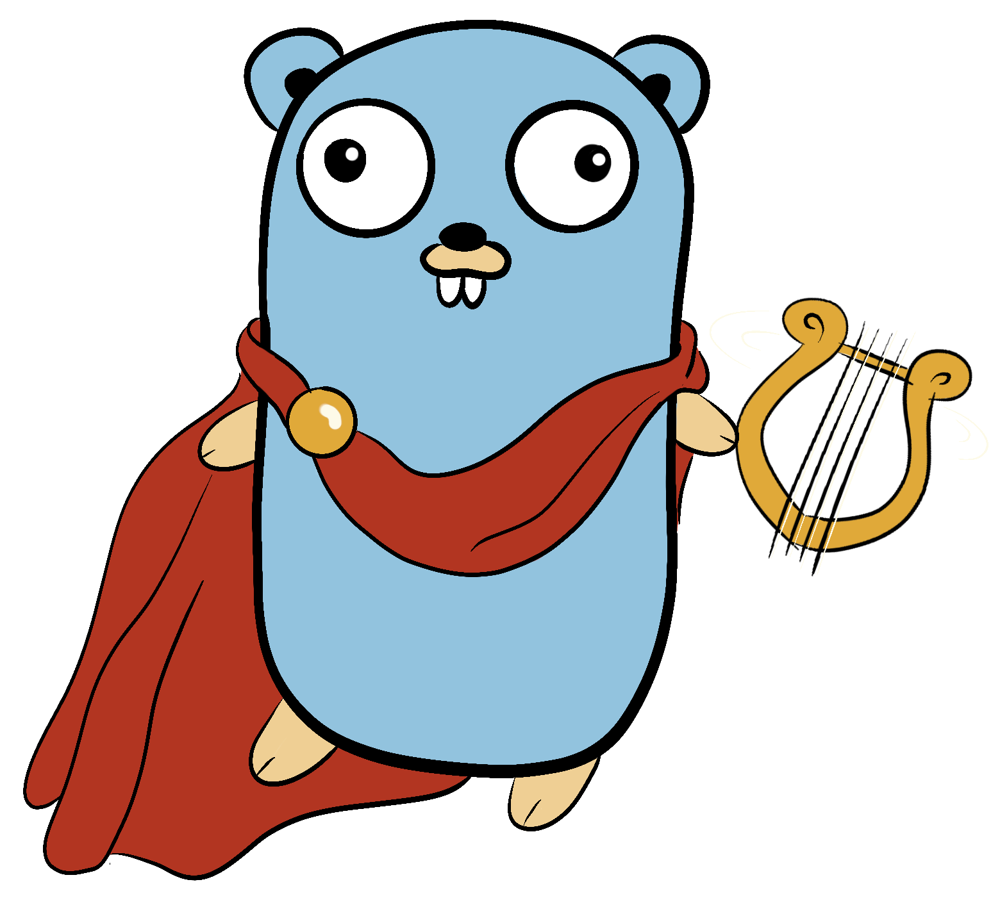

# apollo

Apollo aims to provide useful packages and interfaces for audio consumption.

### Packages
* `ogg` provides a go native ogg encoder and decoder.
* `ffmpeg` provides a wrapper to local ffmpeg calls that implements the `Codec` interface.
* `spotify` wraps the `librespot-golang` package for a simple spotify api calls.

### Useful Interfaces
Apollo provides two top level interfaces that help everything flow together: `Playable` and `Codec`.
`Playable` represents anything that can be identified and read from.
```go
type Playable interface {
	Name() string
	Artist() string
	Album() string
	Metadata() map[string]string
	Duration() time.Duration
	Description() string
	Type() string
	Download() (io.ReadCloser, error)
}
```
Examples of this interface in action can be found in `playable.go` and `spotify/track.go`.

`Codec` represents any kind of encoder or decoder. It essentially is an `io.ReadCloser` that also defines an 
`Open(io.Reader)` method for reuse of the same `Codec` on multiple readers.
```go
type Codec interface {
	Open(io.Reader) error
	io.ReadCloser
}
```
This allows for a `Player` to be created to support any kind of audio format and perform the desired Encoding/Decoding
on them before filling the out channel.

### Using the Player
The player is meant to provide a generic struct that can be used to manage a queue of `Playable`s and process them
onto a channel of `[]byte`. The player also accepts a `Codec` if the enqueued playables also need to be decoded/encoded
before being loaded into the out channel.

```go
package main

import (
	"context"

	"github.com/olympus-go/apollo"
	"github.com/olympus-go/apollo/ogg"
	"github.com/rs/zerolog"
)

func main() {
	config := apollo.PlayerConfig{PacketBuffer: 8192}
	player := apollo.NewPlayer(context.Background(), config, zerolog.Nop()).WithCodec(ogg.NewDecoder())

	// Load a local file into a Playable
	localFile, err := apollo.NewLocalFile("song.opus")
	if err != nil {
		panic(err)
	}

	// Enqueue the file into the player queue
	player.Enqueue(localFile)

	// Start processing the queue
	player.Play()

	for b := range player.Out() {
		// Do stuff with b
		_ = b
	}
}
```
